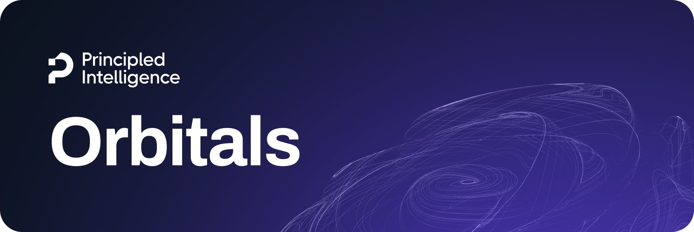

<div align="center">
    
    <h3 align="center">
        <p>
            <b>LLM Guardrails tailored to your Principles</b>
        </p>
    </h4>
</div>

<p align="center">
    
    <!--  -->
    
    
</p>

## Overview

**Orbitals** is a lightweight Python library for adding LLM guardrails in just a few lines of code. With Orbitals, you can add a governance layer tailored to **user-specific principles**. Rather than enforcing generic notions of safety, compliance, and correctness, Orbitals validates inputs (e.g., user requests) and outputs (e.g., assistant responses) against user-defined specifications and custom policies. This makes guardrails explicit, auditable, and aligned with the user's philosophy.

### Key Features

- **User-defined specifications** — Guardrails that match your use case and your custom policies, not generic safety rules
- **Simple integration** — Add guardrails with minimal code changes
- **Open framework, open models** — Orbitals is open-source and is a simple interface for our open models

## Getting started

### Installation

You can install Orbitals via pip:

```bash
pip install orbitals[all]
```

### Basic Usage

Here's a quick example to get you started with Orbitals, in which we use the ScopeGuard module to guard an AI service (for example, a customer support chatbot) from user requests that violate specified principles or fall outside of the scope of the core task of the assistant.

```python
from orbitals.scope_guard import ScopeGuard

ai_service_description = "You are a helpful assistant for ..."
user_message = "Can I buy ..."

guardrail = ScopeGuard()
result = guardrail.validate(user_message, ai_service_description)
```

The result of a guardrail validation will indicate whether the input or output passed the guardrail checks, along with details on any violations. You can then handle violations as needed, such as by rejecting the input or modifying the output. For example:

```python
if result.scope_class.value == "Restricted" or result.scope_class.value == "Out of Scope":
    print("Request violates guardrail:", result.evidences)
else:
    # The user request is safe!
    # We can now pass it to the AI assistant for processing.
    ...
```

### Available Guardrails

Orbitals currently provides the following guardrail modules:

| Guardrail | Description | Hosting Options |
|:----------|:------------|:----------------|
| **[ScopeGuard](README.scope-guard.md)** | Classifies user queries against AI assistant specifications to detect out-of-scope requests, policy violations, and chit-chat | Self-hosted / Cloud hosting |
| 🚀 *Coming Soon* | More guardrails are on the way — stay tuned for updates! | — |

#### Hosting Options

- **Self-hosted**: Use open-weight models that you can deploy on your own infrastructure, ensuring data privacy and control.
- **Cloud hosting**: (Coming soon) Managed hosting options for ease of use and scalability

### Documentation

For detailed documentation, including installation instructions, usage guides, and API references, please visit the Orbitals Documentation.

- [ScopeGuard Documentation](README.scope-guard.md)

### FAQ

- **Can I use Orbitals for commercial applications?**  
  Yes, Orbitals is designed to be used in both research and commercial applications. It is licensed under the Apache 2.0 License, which allows for commercial use.
- **Other questions?**  
  Feel free to reach out to us at [orbitals@principled-intelligence.com](mailto:orbitals@principled-intelligence.com)!

### Contributing

We welcome contributions from the community! If you'd like to contribute to Orbitals, please check out our [Contributing Guide](CONTRIBUTING.md) for guidelines on how to get started.

### License

This project is licensed under the Apache 2.0 License. See the [LICENSE](LICENSE) file for details.

### Contact

For questions, feedback, or support, please reach out to us at [orbitals@principled-intelligence.com](mailto:orbitals@principled-intelligence.com).

---

<div align="center">
    <p>
        <b>Built with ❤️ by <a href="https://principled-intelligence.com">Principled Intelligence</a></b>
        <br />
        Follow us on <a href="https://www.linkedin.com/company/principled-ai/">LinkedIn</a> for the latest updates.
    </p>
</div>
