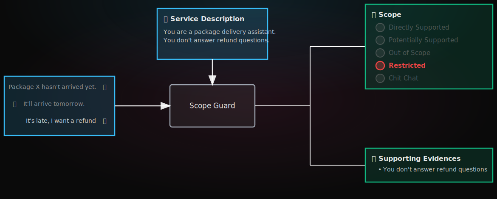

<div align="left">
    <h1>
        <strong>ScopeGuard</strong>
        <div align="left">
            <a href="https://principled-intelligence.com/news/introducing-scope-guard">
                
            </a>
            <!-- <a href="https://demo.halo.principled.app">
                
            </a> -->
            <a href="https://colab.research.google.com/drive/1iBJog8H4QpS3_Y2powR5tidUhWJNajw2">
                
            </a>
        </div>
    </h1>
</div>

Given the specifications of an AI assistant and a user query, `scope-guard` maps the user query to one of the following five classes:

* **Directly Supported**: The query is clearly within the assistant's capabilities.
* **Potentially Supported**: The query could plausibly be handled by the assistant.
* **Out of Scope**: The query is outside the assistant's defined role.
* **Restricted**: The query cannot be handled due to a specific constraint.
* **Chit Chat**: The query is a social interaction not related to the assistant's function.

<p align="center">
  
</p>

To do this, `scope-guard` leverages specialized language models trained to evaluate whether a user query falls within an assistant’s intended scope. Different models are available, released with different deployment options:

| Model | Parameters | Hosting Options | Scope Classification | Custom Safety | Vanilla Safety | Tested GPUs |
| :--- | :--- | :--- | :--- | :--- | :--- | :--- |
| scope-guard-4B-q-2601 | 4B | Self-hosted | 89.1 | 79.1 | 90.3 | T4, L4, L40S, 4090, 5090 |
| scope-guard-4B-g-2601 | 4B | Self-hosted | 90.1 | 78.0 | 88.0 | T4, L4, L40S, 4090, 5090 |
| scope-guard-pro | ~ | Cloud-only | 91.9 | 81.8 | 92.0 | ~ |

## Quickstart with our open models

The easiest way to get started with ScopeGuard is to use our open models, which you can self-host on consumer-grade GPUs (e.g., Nvidia RTX series) and use via the `vllm` or `huggingface` backends. `scope-guard-4B-q-2601` and `scope-guard-4B-g-2601` are both 4B-parameter models so they can run even on a free instance on Google Colab with a T4 GPU.

First, we need to install `orbitals` and `scope-guard`:

```bash
pip install orbitals[scope-guard-vllm]
# or if you prefer to use HuggingFace pipelines for inference instead of vLLM
# pip install orbitals[scope-guard-hf]
```

Then:

```python
from orbitals.scope_guard import ScopeGuard

sg = ScopeGuard(
    backend="vllm",
    model="scope-guard-q",    # for the Qwen-family model
    # model="scope-guard-g",  # for the Gemma-family model
)

ai_service_description = """
You are a virtual assistant for a parcel delivery service.
You can only answer questions about package tracking.
Never respond to requests for refunds.
"""

user_query = "If the package hasn't arrived by tomorrow, can I get my money back?"
result = sg.validate(user_query, ai_service_description)

print(f"Scope: {result.scope_class.value}")
if result.evidences:
    print("Evidences:")
    for evidence in result.evidences:
        print(f"  - {evidence}")

# Scope: Restricted
# Evidences:
#   - Never respond to requests for refunds.
```

## Quickstart with our hosted models

ScopeGuard Pro is our most advanced model, available via API through our managed cloud hosting (get in touch with us if you are interested in on-premise deployment). It achieves best-in-class performance on scope classification tasks, including custom safety evaluations based on user-defined policies.

> Open access to the hosted models is coming soon.  
> Need access earlier? Contact us at [orbitals@principled-intelligence.com](mailto:orbitals@principled-intelligence.com).

First, we need to install `orbitals` and `scope-guard`. In this case, plain `orbitals` is all we need:

```bash
pip install orbitals
```

Then:

```python
from orbitals.scope_guard import ScopeGuard

sg = ScopeGuard(
    backend="api",
    api_key="principled_1234",  # replace with your actual API key
)

ai_service_description = """
You are a virtual assistant for a parcel delivery service.
You can only answer questions about package tracking.
Never respond to requests for refunds.
"""

user_query = "If the package hasn't arrived by tomorrow, can I get my money back?"
result = sg.validate(user_query, ai_service_description)

print(f"Scope: {result.scope_class.value}")
if result.evidences:
    print("Evidences:")
    for evidence in result.evidences:
        print(f"  - {evidence}")

# Scope: Restricted
# Evidences:
#   - Never respond to requests for refunds.
```

## Usage

### Initialization

Initialize the `ScopeGuard` object by specifying the backend and model you want to use.

If you are using the self-hosted models, you can choose between the `vllm` and `huggingface` backends:

```python
from orbitals.scope_guard import ScopeGuard

sg = ScopeGuard(
    model="scope-guard-q",        # for the Qwen-family model
    # model="scope-guard-g",      # for the Gemma-family model
    backend="vllm",               # or "huggingface"
)
```

If you are using the hosted models, use the `api` backend and provide your API key:

```python
from orbitals.scope_guard import ScopeGuard

sg = ScopeGuard(
    backend="api",
    api_key="principled_1234",  # replace with your actual API key
)
```

### Scope Classes

The possible scope classes returned by `scope-guard` are:

```python
from orbitals.scope_guard import ScopeClass
print(ScopeClass.DIRECTLY_SUPPORTED.value)    # "Directly Supported"
print(ScopeClass.POTENTIALLY_SUPPORTED.value) # "Potentially Supported"
print(ScopeClass.OUT_OF_SCOPE.value)          # "Out of Scope"
print(ScopeClass.RESTRICTED.value)            # "Restricted"
print(ScopeClass.CHIT_CHAT.value)             # "Chit Chat"
```

For example, you can check the scope class of a validation result as follows:

```python
result = sg.validate(user_query, ai_service_description)

# Using the Enum member:
if result.scope_class == ScopeClass.RESTRICTED:
    print("The user query is restricted.")

# Or using the string value:
if result.scope_class.value == "Restricted":
    print("The user query is restricted.")
```

### Input Formats

The `validate` method is flexible and accepts various input formats for the conversation.

#### User query as a string

```python
result = sg.validate(
    "When is my package scheduled to arrive?",
    ai_service_description
)
```

#### User query as a dictionary (OpenAI's API Message)

```python
result = sg.validate(
    {
        "role": "user", 
        "content": "When is my package scheduled to arrive?"
    },
    ai_service_description
)
```

#### Conversation as a list of dictionaries

```python
result = sg.validate(
    [
        {
            "role": "user", 
            "content": "I ordered a package, tracking number 1234567890"
        },
        {
            "role": "assistant", 
            "content": "Great, the package is in transit. What would you like to know?"
        },
        {
            "role": "user", 
            "content": "If it doesn't arrive tomorrow, can I get a refund"    
        },
    ], 
    ai_service_description
)
```

This format lets you pass **multi-turn conversations**. Note that the scope decision is computed exclusively for **the final user message**, with earlier turns considered only as conversational context.

### AI Service Description

The AI service description can be provided in two ways:

1. **As a single string**: straightforward way to describe the assistant's purpose and constraints.
2. **As a structured object**: For more detailed specifications and better performance, you can provide a `orbitals.types.AIServiceDescription` object (**strongly recommended approach**).

### Batch Processing

You can process multiple conversations at once using `batch_validate`.

#### Single AI Service Description

```python
queries = [
    "If the package hasn't arrived by tomorrow, can I get my money back?",
    "When is the package expected to be delivered?"
]

result = sg.batch_validate(
    queries,
    ai_service_description=ai_service_description
)
```

#### Multiple AI Service Descriptions

```python
ai_service_descriptions = [
    "You are a virtual assistant for Postal Service. You only answer questions about package tracking. Never respond to refund requests.",
    "You are a virtual assistant for a Courier. You answer questions about package tracking. Never respond to refund requests."
]

result = sg.batch_validate(
    queries,
    ai_service_descriptions=ai_service_descriptions
)
```

## Serving ScopeGuard on-premise or on your infrastructure

`scope-guard` comes with built-in support for serving. For better performance, it consists of two components:

1. A **vLLM serving engine** that runs the model
2. A **FastAPI server** that provides the end-to-end API interface, mapping input data to prompts, invoking the vLLM serving engine and returning the response to the user

All of this is configured via the `orbitals scope-guard serve` command:

```bash
# install the necessary packages
pip install orbitals[scope-guard-serve]

# start everything
orbitals scope-guard serve scope-guard --port 8000
```

Once the server is running, you can interact with it as follows:

#### 1. Direct HTTP Requests

Send requests to the `/orbitals/scope-guard/validate` (or `/orbitals/scope-guard/batch-validatevalidate`) endpoint using cURL or any HTTP client:

```bash
curl -X 'POST' \
    'http://localhost:8000/orbitals/scope-guard/validate' \
    -H 'accept: application/json' \
    -H 'Content-Type: application/json' \
    -d '{
        "conversation": "If the package doesn''t arrive by tomorrow, can I get my money back?",
        "ai_service_description": "You are a virtual assistant for a parcel delivery service. You can only answer questions about package tracking. Never respond to requests for refunds."
    }'
```

Response:

```json
{
    "evidences": [
        "Never respond to requests for refunds."
    ],
    "scope_class": "Restricted",
    "time_taken": 0.23,
    "model": "<model>"
}
```

#### 2. Python SDK

`scope-guard` comes with built-in SDKs to invoke the server directly from Python (both sync and async).

**Synchronous API client:**

```python
from orbitals.scope_guard import ScopeGuard

sg = ScopeGuard(
    backend="api",
    api_url="http://localhost:8000"
)

result = sg.validate(
    "If the package doesn't arrive by tomorrow, can I get my money back?",
    "You are a virtual assistant for a parcel delivery service. You can only answer questions about package tracking. Never respond to requests for refunds."
)
```

**Asynchronous API client:**

```python
from orbitals.scope_guard import AsyncScopeGuard

sg = AsyncScopeGuard(
    backend="api",
    api_url="http://localhost:8000"
)

result = await sg.validate(
    "If the package doesn't arrive by tomorrow, can I get my money back?",
    "You are a virtual assistant for a parcel delivery service. You can only answer questions about package tracking. Never respond to requests for refunds."
)
```

## FAQ

### vLLM is using too much GPU memory

If `scope-guard` with the `vllm` backend (or `scope-guard serve`) is consuming too much GPU memory, you can reduce the `gpu_memory_utilization` parameter in `VLLMScopeGuard` (or set the `--vllm-gpu-memory-utilization` for `orbitals scope-guard serve`) flag when using the serve command. The default is 0.9 (90%), but you can lower it to free up GPU resources for other tasks.

### Getting Out of Memory (OOM) errors with vLLM

If you're experiencing OOM errors with the `vllm` backend (or when serving the model), you have two options:

1. **Lower `gpu_memory_utilization`**: Reduce the amount of GPU memory allocated to vLLM using the `gpu_memory_utilization` parameter or `--vllm-gpu-memory-utilization` flag.
2. **Reduce `max_model_len`**: Decrease the maximum model length using the `max_model_len` parameter or `--vllm-max-model-len` flag. **Note**: Be careful with this option, as the combined input and generated output must be shorter than the value you set.

## License

This project is licensed under the Apache 2.0 License.
